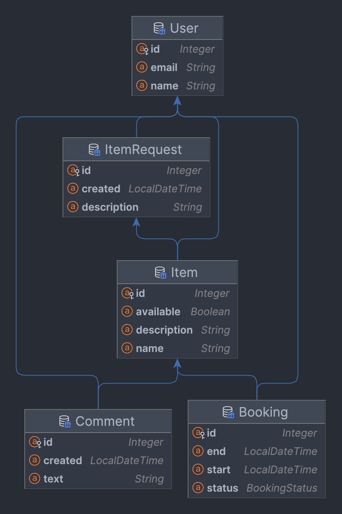

# Shareit

Shareit - является сервисом для шеринга (проката) вещей. Позволяет хранить в базе данных информацию о пользователях, вещях, которые они готовы предоставить на прокат, создавать запросы на бронирование (аренду), обрабатывать запросы (принимать или отклонять, т.д.), добавлять комментарии пользователей.

---

### Описание сервисов:

REST приложение реализовано с использованием микросервисной архитектуры.

1. Основной сервис — содержит всё необходимое для работы продукта
2. Gateway - выполняет валидацию и кеширование запросов, снижая нагрузку на основной сервис

---

### Функциональность

Пользователь, который добавляет в приложение новую вещь, считается ее владельцем. При добавлении вещи есть возможность указать её краткое название и добавить небольшое описание. Для поиска вещей организован поиск. Чтобы воспользоваться нужной вещью, её требуется забронировать. Бронируется вещь всегда на определённые даты. Владелец вещи обязательно должен подтвердить бронирование. После того как вещь возвращена, у пользователя, который её арендовал, есть возможность оставить отзыв. Ещё одна возможность сервиса — запрос вещи ItemRequest. Пользователь создаёт запрос, если нужная ему вещь не найдена при поиске. В запросе указывается, что именно он ищет. В ответ на запрос другие пользователи могут добавить нужную вещь.

---

### Схема базы данных



---

### Стек технологий

* Java 11
* Spring Boot 2.7
* Hibernate
* PostgreSQL
* Maven
* Docker Compose
* Postman
* JUnit
* Mockito

---

### Запуск приложения

Потребуется Java 11, Docker, Git, Apache Maven

1. Склонировать

```shell
git clone https://github.com/Azark1n/java-shareit
```

2. Собрать проект

```shell
mvn clean package
```

3. Запустить через Docker Compose

```shell
docker compose up
```

---

### Выполнение тестирования

Подготовлены коллекции тестов, используя Postman:

```shell
postman/specification_1.json
postman/specification_2.json
postman/specification_3.json
postman/specification_4.json
```
